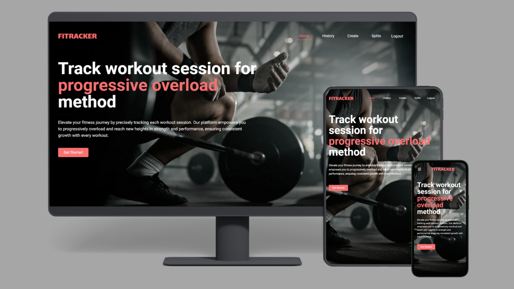

# FITRACKER

**FITRACKER** is a web-based fitness tracker that helps you log and track every detail of your workout sessions using the **progressive overload method**. Track exercises, sets, reps, weights, and create custom workout plans to meet your fitness goals.

---

## Demo

- **Frontend:** [https://fitracker-web.netlify.app/](https://fitracker-web.netlify.app/)  
- **Backend API:** [https://fitracker-api.vercel.app/](https://fitracker-api.vercel.app/)

---

## UI Preview



---

## Features

- Log all details of workout sessions: exercises, sets, reps, and weights
- Track progress over time for each exercise
- Create and customize workout plans or use expert-recommended splits
- Secure authentication system to protect personal data
- Sync workout history and plans across devices
- User-friendly and responsive UI for both desktop and mobile

---

## Tech Stack

**Frontend:**

- React 18  
- React Router DOM  
- Tailwind CSS  
- Axios for API requests  
- React Cookie for session handling  
- date-fns for date formatting  
- react-loading-skeleton for loading states  
- UUID & bson-objectid for unique identifiers  

**Backend:**

- Node.js & Express  
- MongoDB with Mongoose  
- JWT authentication  
- express-session & connect-mongodb-session for sessions  
- bcrypt for password hashing  
- express-validator for request validation  
- dotenv & CORS for environment setup and API handling  

---

## Environment Variables

**Backend:**
Create a `.env` file in the backend root with the following:
  ```bash
   MONGODB_URI=your_mongodb_connection_string
   PORT=your_server_port
   SECRET_KEY=your_jwt_secret_key
  ```

---

## Installation

1. Clone the repository:
  ```bash
  git clone https://github.com/mark-ianz/fitracker.git
  ```

2. Navigate to the project folder:
  ```bash
  cd fitracker
  ```

##Frontend:##
1. Navigate to the frontend folder:
  ```bash
  cd frontend
  ```

2. Install dependencies:
  ```bash
  npm install
  ```

3. Run the development server:
  ```
  npm start
  ```
The frontend will be available at http://localhost:3000 (or as defined in your React setup).

##Backend:##
1. Navigate to the backend folder:
  ```bash
  cd backend
  ```

2. Install dependencies:
  ```bash
  npm install
  ```

3. Start the server (development mode):
  ```
  npm run dev
  ```
The backend will run on http://localhost:PORT (defined in your .env).
